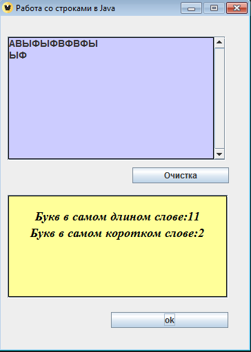

# praktika4
| Фамилия, имя студента | Группа    | Дисциплина  |Тема                              
| --------------------- |:---------:| ------------|:--------------------------------:|
| Федоренко Виталий     | ИС-302    | СВП         |2.Работа со строками |Задание:Дан текст. Найти длинну самого короткого и длинного слова. 

Как выглядит визуально выглядит программа: 

